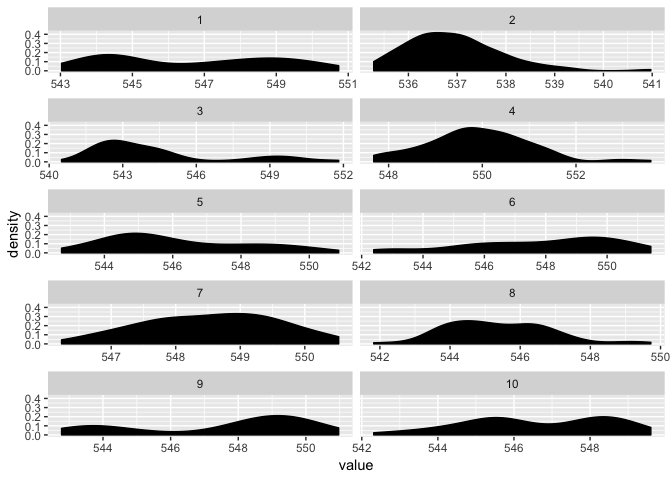

<!-- README.md is generated from README.Rmd. Please edit that file -->

# dualchain

The goal of dualchain is to help create good and bad MCMC samples for an
upcoming experiment

## Installation

You can install dualchain from github with:

``` r
# install.packages("devtools")
devtools::install_github("njtierney/dualchain")
```

## Example

This is mainly for Miles:

Create the samples

``` r
library(dualchain)
lawful_good <- mcmc_generator(max_mixtures = 2,
                              burn_in = 1000,
                              samples = 1000,
                              extra_sample = 1000)
#> Compiling model graph
#>    Resolving undeclared variables
#>    Allocating nodes
#> Graph information:
#>    Observed stochastic nodes: 50
#>    Unobserved stochastic nodes: 50
#>    Total graph size: 163
#> 
#> Initializing model

chaotic_evil <- mcmc_generator(max_mixtures = 10,
                               burn_in = 1000,
                               samples = 1000,
                               extra_sample = 1000)
#> Compiling model graph
#>    Resolving undeclared variables
#>    Allocating nodes
#> Graph information:
#>    Observed stochastic nodes: 50
#>    Unobserved stochastic nodes: 58
#>    Total graph size: 211
#> 
#> Initializing model
```

Create the raw lineup data

``` r

raw_data <- prepare_raw_lineup(good_mcmc_list = lawful_good$extra_eyes,
                               evil_mcmc_list = chaotic_evil$extra_eyes,
                               n_chain = 1)
raw_data
#> # A tibble: 2,000 x 6
#>    Iteration Chain Parameter value alignment chain_group
#>        <int> <int> <chr>     <dbl> <chr>           <int>
#>  1         1     1 lambda[1]  537. good                1
#>  2         2     1 lambda[1]  537. good                1
#>  3         3     1 lambda[1]  537. good                1
#>  4         4     1 lambda[1]  537. good                1
#>  5         5     1 lambda[1]  538. good                1
#>  6         6     1 lambda[1]  537. good                1
#>  7         7     1 lambda[1]  538. good                1
#>  8         8     1 lambda[1]  538. good                1
#>  9         9     1 lambda[1]  537. good                1
#> 10        10     1 lambda[1]  537. good                1
#> # ... with 1,990 more rows
```

Create the lineup data

``` r

data_lineup <- add_groups_and_facets(raw_data)

data_lineup
#> # A tibble: 1,000 x 7
#>    chain_group facet Iteration Chain Parameter value alignment
#>          <int> <int>     <int> <int> <chr>     <dbl> <chr>    
#>  1           1     4         1     1 lambda[1]  537. good     
#>  2           1     4         2     1 lambda[1]  537. good     
#>  3           1     4         3     1 lambda[1]  537. good     
#>  4           1     4         4     1 lambda[1]  537. good     
#>  5           1     4         5     1 lambda[1]  538. good     
#>  6           1     4         6     1 lambda[1]  537. good     
#>  7           1     4         7     1 lambda[1]  538. good     
#>  8           1     4         8     1 lambda[1]  538. good     
#>  9           1     4         9     1 lambda[1]  537. good     
#> 10           1     4        10     1 lambda[1]  537. good     
#> # ... with 990 more rows
```

create the solution

``` r

lineup_solution <- retrieve_lineup_solution(data_lineup)
lineup_solution
#> # A tibble: 10 x 3
#>    chain_group facet alignment
#>          <int> <int> <chr>    
#>  1           1     4 good     
#>  2           2     2 evil     
#>  3           3     1 evil     
#>  4           4     3 evil     
#>  5           5     7 evil     
#>  6           6     8 evil     
#>  7           7    10 evil     
#>  8           8     6 evil     
#>  9           9     5 evil     
#> 10          10     9 evil
```

Create the plots

The regular `gg_` plots return a plot invisibly

``` r
ac <- gg_mcmc_autocor(data_lineup)
den <- gg_mcmc_density(data_lineup)
tra <- gg_mcmc_trace(data_lineup)

ac
```

<!-- -->

``` r
den
```

<!-- -->

``` r
tra
```

<!-- -->

You can also call them directly like so:

``` r
mcmc_diagnostic_plot(data_lineup, plot_type = "trace")
```

<!-- -->

# passing to shiny

And here is the list to pass to shiny

``` r
clos <- generate_experiment(good_mcmc = lawful_good$extra_eyes,
                            bad_mcmc = chaotic_evil$extra_eyes,
                            n_chain = 1,
                            plot_type = "trace")

clos()
#> $solution
#> # A tibble: 10 x 3
#>    chain_group facet alignment
#>          <int> <int> <chr>    
#>  1           9     7 good     
#>  2           1     9 evil     
#>  3           2     6 evil     
#>  4           3     4 evil     
#>  5           4     8 evil     
#>  6           5    10 evil     
#>  7           6     5 evil     
#>  8           7     2 evil     
#>  9           8     3 evil     
#> 10          10     1 evil     
#> 
#> $plot
```

<!-- -->
